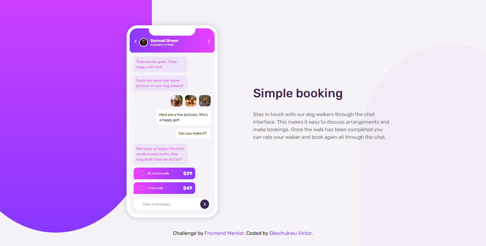
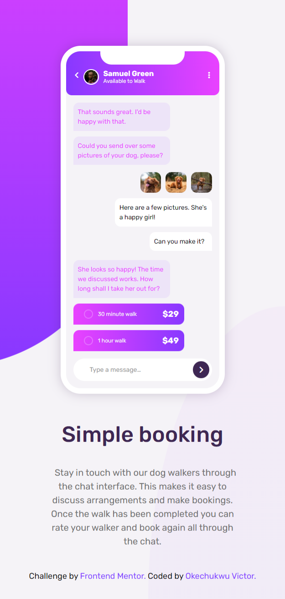

# Frontend Mentor - Chat app CSS illustration solution

This is a solution to the [Chat app CSS illustration challenge on Frontend Mentor](https://www.frontendmentor.io/challenges/chat-app-css-illustration-O5auMkFqY). Frontend Mentor challenges help you improve your coding skills by building realistic projects. 

## Table of contents

- [Overview](#overview)
  - [The challenge](#the-challenge)
  - [Screenshot](#screenshot)
  - [Links](#links)
  - [Built with](#built-with)
  - [What I learned](#what-i-learned)
  - [Continued development](#continued-development)
- [Author](#author)


## Overview

### The challenge

Users should be able to:

- View the optimal layout depending on their device's screen size

### Screenshot





### Links

- Solution URL: [ solution URL here](https://github.com/covstar/chat-app-css-illustration)
- Live Site URL: [live site URL here](https://covstar.github.io/chat-app-css-illustration/)


### Built with

- Semantic HTML5 markup
- CSS custom properties
- Flexbox
- CSS Grid


### What I learned

I flaunt my css skills and mehn it was awesome.

 code snippets, see below:

```html
<div>Some HTML code I'm proud of</div>
```
```css
.proud-of-this-css {
  display: grid;
}
```

### Continued development

continued development on CSS flexbox.

## Author

- Website - [Add your name here](https://covstar.github.io/)
- Frontend Mentor - [@covstar](https://www.frontendmentor.io/profile/covstar)
- Twitter - [@covtsar_](https://www.twitter.com/covstar_)


